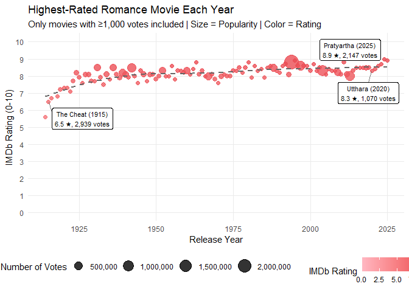
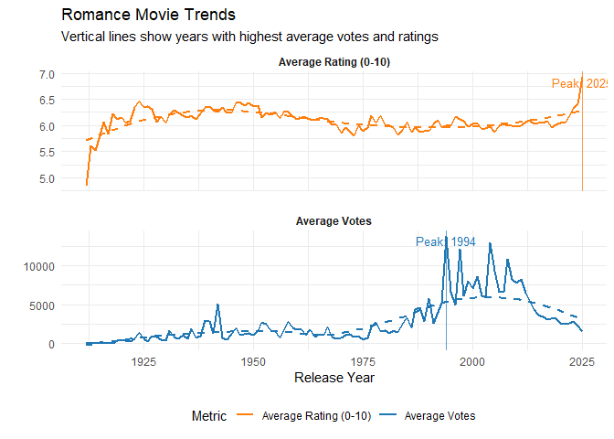

Romance Movies
================

- [**How have romance movies’ average ratings and vote counts changed
  over time, and which movie had the highest rating in each
  year?**](#how-have-romance-movies-average-ratings-and-vote-counts-changed-over-time-and-which-movie-had-the-highest-rating-in-each-year)
  - [**What data did you find to help answer that
    question?**](#what-data-did-you-find-to-help-answer-that-question)
  - [**What is the relevant background on your
    question?**](#what-is-the-relevant-background-on-your-question)
  - [**What level of (quantified) certainty do you have in your
    results?**](#what-level-of-quantified-certainty-do-you-have-in-your-results)
  - [**What conclusions did you come
    to?**](#what-conclusions-did-you-come-to)
  - [**What questions do you have
    remaining?**](#what-questions-do-you-have-remaining)

## **How have romance movies’ average ratings and vote counts changed over time, and which movie had the highest rating in each year?**

``` r
library(tidyverse)
```

    ## ── Attaching core tidyverse packages ──────────────────────── tidyverse 2.0.0 ──
    ## ✔ dplyr     1.1.4     ✔ readr     2.1.5
    ## ✔ forcats   1.0.0     ✔ stringr   1.5.1
    ## ✔ ggplot2   3.5.1     ✔ tibble    3.2.1
    ## ✔ lubridate 1.9.4     ✔ tidyr     1.3.1
    ## ✔ purrr     1.0.2     
    ## ── Conflicts ────────────────────────────────────────── tidyverse_conflicts() ──
    ## ✖ dplyr::filter() masks stats::filter()
    ## ✖ dplyr::lag()    masks stats::lag()
    ## ℹ Use the conflicted package (<http://conflicted.r-lib.org/>) to force all conflicts to become errors

``` r
library(ggplot2)
library(readr)
library(ggrepel)
```

### **What data did you find to help answer that question?**

The IMDB data is from their Non-Commercial Data Set collection. This
contains several data sets with information such as movie title, release
date, genre, rating, actor biographical information, and more. This data
collection is very intensive, with over 11,000,000 entries, each
representing different short films, movies, and show episodes. The data
comes verbatim from IMDb, a reputable and very popular movie rating
service. It is for these reasons that we decided to use this dataset for
our project. In fact, there was initially too much useful data to
include in our scope, which is why we focused on romance movies. In
particular, we used the ‘title.basics’ data set, which contained the
movie’s primary/original title, genre, duration type, runtime, year of
release, and whether it was rated for adults. We also used the
‘title.ratings’ dataset which contained the number of votes and average
rating for each movie. These datasets were merged using the movies’ IMDb
ascribed alphanumeric identifiers to create a singular comprehensive
dataset.

### **What is the relevant background on your question?**

The first romance movie on the dataset is 1894’s “Miss Jerry.” This
inspired us to plot the ratings of all the romance movies over the 133
years represented in our data set. Within this time span, we decided to
highlight when IMDb was established as a platform, as the rating counts
would increase past this point as IMDb becomes an accessible service for
newly released movies and their critics. Uncertainty in our model can
come from this fact, in that there are less votes for older movies,
creating a lesser confidence rating and negating titles that can
otherwise be considered mainstream. We also made the choice to filter
out all the movies that had less than 1,000 reviews, that way we could
evaluate the mainstream movies we were targeting with our question.

``` r
basics <- read_tsv("title.basics.tsv.gz",
                   na = "\\N",
                   progress = TRUE)
```

    ## Warning: One or more parsing issues, call `problems()` on your data frame for details,
    ## e.g.:
    ##   dat <- vroom(...)
    ##   problems(dat)

    ## Rows: 11621071 Columns: 9
    ## ── Column specification ────────────────────────────────────────────────────────
    ## Delimiter: "\t"
    ## chr (5): tconst, titleType, primaryTitle, originalTitle, genres
    ## dbl (4): isAdult, startYear, endYear, runtimeMinutes
    ## 
    ## ℹ Use `spec()` to retrieve the full column specification for this data.
    ## ℹ Specify the column types or set `show_col_types = FALSE` to quiet this message.

``` r
glimpse(basics)
```

``` r
ratings <- read_tsv("title.ratings.tsv.gz",
                    na = "\\N",
                    progress = TRUE)
```

    ## Rows: 1562853 Columns: 3
    ## ── Column specification ────────────────────────────────────────────────────────
    ## Delimiter: "\t"
    ## chr (1): tconst
    ## dbl (2): averageRating, numVotes
    ## 
    ## ℹ Use `spec()` to retrieve the full column specification for this data.
    ## ℹ Specify the column types or set `show_col_types = FALSE` to quiet this message.

``` r
glimpse(ratings)
```

``` r
romance_movies <- basics %>%
  # Filter for movies that include Romance in genres
  filter(titleType == "movie",
         str_detect(genres, "Romance"),
         !is.na(startYear),
         startYear >= 1900) %>%
  # Convert startYear to numeric (handling any remaining NAs)
  mutate(startYear = as.numeric(startYear)) %>%
  # Join with ratings data
  inner_join(ratings, by = "tconst") %>%
  # Create decade column for broader trends
  mutate(decade = floor(startYear / 10) * 10)
```

``` r
# Get top movie per year with minimum vote threshold
top_movies_yearly <- romance_movies %>%
  filter(titleType == "movie",
         numVotes >= 1000) %>%  # Minimum 1,000 votes
  group_by(startYear) %>%
  slice_max(order_by = averageRating, n = 1, with_ties = FALSE) %>%
  ungroup() %>%
  mutate(label = paste0(primaryTitle, " (", startYear, ")\n", 
                       round(averageRating, 1), " ★, ", 
                       scales::comma(numVotes), " votes"))

# Create the visualization
ggplot(top_movies_yearly, aes(x = startYear, y = averageRating)) +
  geom_point(aes(size = numVotes, color = averageRating), alpha = 0.8) +
  geom_smooth(method = "loess", color = "grey40", se = FALSE, linetype = "dashed") +
  
  # Smart labeling - show every 5 years + exceptionally popular movies
  geom_label_repel(
    data = top_movies_yearly %>% 
      filter(startYear %% 5 == 0 | numVotes > 50000),
    aes(label = label),
    size = 3,
    box.padding = 0.5,
    max.overlaps = 20,
    segment.color = "grey50"
  ) +
  
  # Scales and colors
  scale_color_gradient(low = "#ffb6c1", high = "#e63946", 
                      name = "IMDb Rating", limits = c(0, 10)) +
  scale_size_continuous(name = "Number of Votes", 
                       range = c(2, 8),
                       labels = scales::comma) +
  scale_y_continuous(limits = c(0, 10), breaks = seq(0, 10, 1)) +
  
  # Labels and theme
  labs(
    title = "Highest-Rated Romance Movie Each Year",
    subtitle = "Only movies with ≥1,000 votes included | Size = Popularity | Color = Rating",
    x = "Release Year",
    y = "IMDb Rating (0-10)"
  ) +
  theme_minimal() +
  theme(
    legend.position = "bottom",
    panel.grid.minor = element_blank()
  )
```

    ## `geom_smooth()` using formula = 'y ~ x'

    ## Warning: ggrepel: 39 unlabeled data points (too many overlaps). Consider
    ## increasing max.overlaps

<!-- -->

``` r
# First calculate the peak years
peak_years <- romance_movies %>%
  filter(titleType == "movie") %>%
  group_by(startYear) %>%
  summarise(
    avg_votes = mean(numVotes, na.rm = TRUE),
    avg_rating = mean(averageRating, na.rm = TRUE),
    movie_count = n()
  ) %>%
  filter(movie_count >= 5) %>%
  summarise(
    peak_vote_year = startYear[which.max(avg_votes)],
    peak_rating_year = startYear[which.max(avg_rating)]
  ) %>%
  distinct()

# Create the plot with vertical lines
romance_movies %>%
  filter(titleType == "movie") %>%
  group_by(startYear) %>%
  summarise(
    avg_votes = mean(numVotes, na.rm = TRUE),
    avg_rating = mean(averageRating, na.rm = TRUE),
    movie_count = n()
  ) %>%
  filter(movie_count >= 5) %>%
  pivot_longer(cols = c(avg_votes, avg_rating), 
               names_to = "metric", 
               values_to = "value") %>%
  mutate(metric = case_when(
    metric == "avg_votes" ~ "Average Votes",
    metric == "avg_rating" ~ "Average Rating (0-10)"
  )) %>%
  ggplot(aes(x = startYear, y = value, color = metric)) +
  # Vertical lines for peak years
  geom_vline(data = data.frame(metric = "Average Votes", 
                              xintercept = peak_years$peak_vote_year),
             aes(xintercept = xintercept), 
             color = "#1f77b4", linetype = "solid", size = 0.7, alpha = 0.7) +
  geom_vline(data = data.frame(metric = "Average Rating (0-10)", 
                              xintercept = peak_years$peak_rating_year),
             aes(xintercept = xintercept), 
             color = "#ff7f0e", linetype = "solid", size = 0.7, alpha = 0.7) +
  # Main plot elements
  geom_line(size = 1) +
  geom_smooth(method = "loess", se = FALSE, linetype = "dashed") +
  # Peak year labels
  geom_text(data = data.frame(metric = "Average Votes",
                             x = peak_years$peak_vote_year,
                             y = Inf,
                             label = paste("Peak:", peak_years$peak_vote_year)),
            aes(x = x, y = y, label = label),
            vjust = 1.5, color = "#1f77b4", size = 3.5) +
  geom_text(data = data.frame(metric = "Average Rating (0-10)",
                             x = peak_years$peak_rating_year,
                             y = Inf,
                             label = paste("Peak:", peak_years$peak_rating_year)),
            aes(x = x, y = y, label = label),
            vjust = 1.5, color = "#ff7f0e", size = 3.5) +
  facet_wrap(~metric, scales = "free_y", ncol = 1) +
  scale_color_manual(values = c("Average Votes" = "#1f77b4", 
                               "Average Rating (0-10)" = "#ff7f0e")) +
  labs(
    title = "Romance Movie Trends",
    subtitle = "Vertical lines show years with highest average votes and ratings",
    x = "Release Year",
    y = "",
    color = "Metric"
  ) +
  theme_minimal() +
  theme(
    legend.position = "bottom",
    strip.text = element_text(face = "bold"),
    panel.spacing = unit(1, "lines")
  )
```

    ## Warning: Using `size` aesthetic for lines was deprecated in ggplot2 3.4.0.
    ## ℹ Please use `linewidth` instead.
    ## This warning is displayed once every 8 hours.
    ## Call `lifecycle::last_lifecycle_warnings()` to see where this warning was
    ## generated.

    ## `geom_smooth()` using formula = 'y ~ x'

<!-- -->

### **What level of (quantified) certainty do you have in your results?**

We are confident that our top 10 movies are acceptable results, because
we filtered films with less than 1,000 votes. Any movies missing from
the IMDb database would be less popular movies, and thus would be
irrelevant to our study anyways. This ensures we reduce the noise of
films with fewer votes often have inflated ratings, our cutoff ensures
the stability in our model. However, considering the fact that IMDb is
the most comprehensive database of movies available, we cannot find a
larger population to quantify uncertainty in our existing sample of
movies. We compared our top movies from our figure to the current top
ten romance movies listed in IMDB. We have an overlap of 5/10 movies in
our visual, the reason for this is that all the films in the top 10
romance IMDB list are filtered differently and have at least 40 k votes.

### **What conclusions did you come to?**

We created two graphs: Romance Movie Trends and Highest-Rated Romance
Movie of Each Year.

The first one creates a visualization of two separate line graphs,
pulling data from movies that have at least one of the genres filled as
romance. The orange graph at the top focuses on the average rating for
every movie and gives an average for all of the ones that came out in
the same year. The blue graph on the bottom shows the average number of
votes for each movie and complies all of the ones that came out in the
same year.

The second graph creates a visualization of a line chart plotting the
highest rated romance movie that came out in a given year, filtered by
titles that have over a thousand votes. The graph features dots that
change saturation depending on the rating, and the dots’ size depends on
how many votes a movie has.

We discovered that the highest-rated mainstream romance movies have come
out in the 2020s, with 2025 being the peak. This would mean that the
best movies are coming out currently! We decided that it may not be the
most accurate, as a small number of votes could oversaturate the rating,
and so we graphed the highest rating for each movie per year over 1,000
votes. To answer our question, ‘How have romance movies’ average ratings
and vote counts changed over time, and which movie had the highest
rating in each year?’, romance movies have the highest average ratings
that they’ve ever had, and IMDb votes jumped right after the site
launched.

### **What questions do you have remaining?**

One question we have is how to quantitatively establish what films are
‘mainstream’. In this study, we just arbitrarily established movies with
over 1,000 votes as mainstream, but perhaps there is a more precise and
accurate way to quantify a mainstream movie. Further, while IMDb is the
most comprehensive database of movies available to the public, there is
the concept of ‘lost media’ that we cannot account for. There are movies
and TV shows that existed but no longer have any physical record and
thus cannot be represented in the IMDb dataset. Perhaps if we had a
count of the lost media, we could create a confidence interval to
account for this lack of data.
